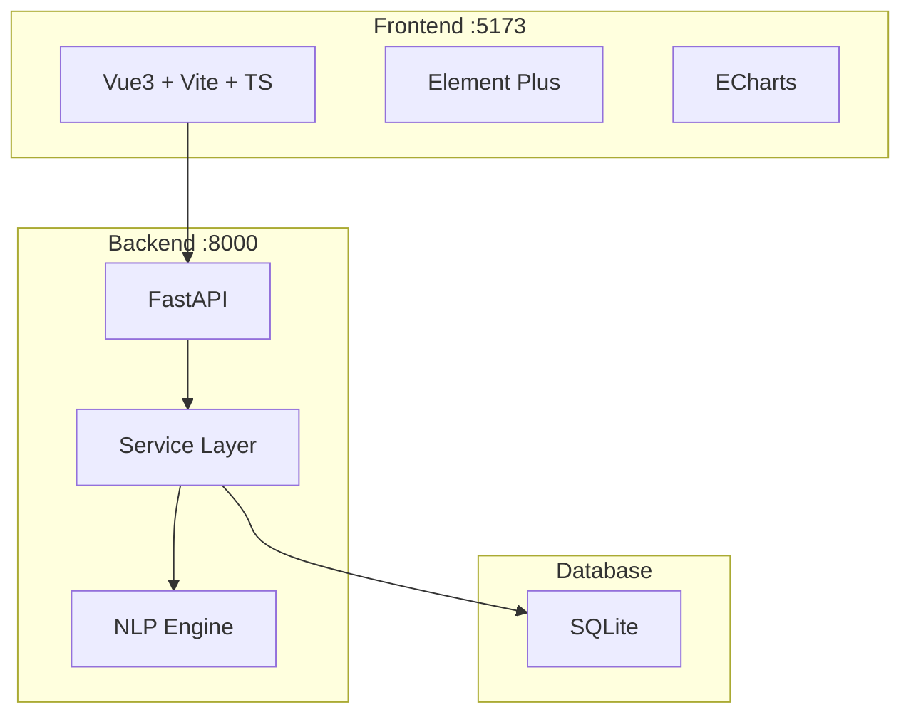

# GradCareer-CommentAnalysis 毕业生评论分析平台

[](https://www.python.org/)
[](https://fastapi.tiangolo.com/)
[](https://vuejs.org/)
[](LICENSE)

## 项目简介 / Project Overview

**中文 NLP 分析平台**，针对 B站 (Bilibili) 考研相关视频评论，特别是**应用统计学（应用统计学）**方向，进行情感分析、主题建模、关键词提取和趋势分析。

A Chinese NLP analysis platform for Bilibili comments on graduate school entrance exam (考研) videos, specializing in **Applied Statistics (应用统计学)**. Transforms raw comments into sentiment distributions, topic clusters, keyword co-occurrence networks, and temporal trend insights.

## 系统架构 / System Architecture



## 技术栈 / Tech Stack

| 层级 | 技术 |
|------|------|
| **Backend** | FastAPI + SQLAlchemy (async) + SQLite (aiosqlite) + Pydantic v2 |
| **NLP** | jieba + SnowNLP + scikit-learn + Gensim LDA + BERTopic + networkx |
| **Frontend** | Vue3 + Vite + TypeScript + Element Plus + ECharts + Pinia |
| **Infra** | Docker + docker-compose + GitHub Actions |

## 快速开始 / Quick Start

### 前置要求 / Prerequisites

- Python 3.12+
- Node.js 18+
- pnpm (推荐 / recommended)

### Backend 启动

```bash
cd backend
pip install -r requirements.txt
python scripts/seed_db.py  # 导入数据并运行分析流水线 / Import data and run analysis pipeline
uvicorn app.main:app --reload
```

### Frontend 启动

```bash
cd frontend
pnpm install
pnpm dev
```

### Docker 部署

```bash
docker-compose up -d
```

## API 文档 / API Documentation

启动 Backend 后访问：http://localhost:8000/docs

## 项目结构 / Project Structure

```
GradCareer-CommentAnalysis/
├── backend/
│   ├── app/
│   │   ├── api/              # FastAPI route handlers
│   │   ├── models/           # SQLAlchemy ORM models
│   │   ├── schemas/          # Pydantic request/response schemas
│   │   ├── services/         # Business logic and NLP pipeline
│   │   └── utils/            # Chinese text helpers, NLP resources
│   ├── data/                 # CSV源数据、停用词、自定义词典、同义词表
│   ├── scripts/              # 数据导入和初始化脚本
│   ├── tests/                # pytest 测试用例
│   ├── requirements.txt      # Python 依赖
│   └── pyproject.toml        # 项目配置 (Ruff, Mypy, Pytest)
├── frontend/
│   └── src/
│       ├── views/            # 7页面：概览、情感、主题、主题情感、趋势、网络、预测
│       ├── stores/           # Pinia 状态管理
│       ├── components/       # 可复用组件 (含8个ECharts图表)
│       ├── api/              # Axios API 客户端
│       ├── router/           # Vue Router 配置
│       └── types/            # TypeScript 类型定义
├── scripts/                  # 项目级别脚本
├── data/                     # 原始数据文件（已迁移到 backend/data/）
├── legacy/                   # 旧版扁平脚本（已归档）
├── .github/                  # GitHub Actions CI/CD
├── docker-compose.yml
├── LICENSE
└── README.md
```

## 数据说明 / Data Dictionary

| 字段 | 类型 | 说明 |
|------|------|------|
| comment_id | bigint | B站评论唯一标识 |
| parent_comment_id | bigint | 父评论ID（0=顶级评论） |
| create_time | int | Unix时间戳（秒） |
| video_id | bigint | B站视频标识 |
| content | text | 评论文本内容 |
| user_id | bigint | 用户唯一标识 |
| nickname | text | 用户昵称 |
| avatar | text | 用户头像URL |
| sub_comment_count | int | 子评论数量 |
| last_modify_ts | float | 最后修改时间戳 |

## 分析功能 / Analysis Features

1. **情感分析 / Sentiment Analysis** — SnowNLP 情感极性分布，正面/中性/负面分类
2. **主题建模 / Topic Modeling** — LDA + BERTopic 主题提取与可视化
3. **关键词网络 / Keyword Network** — jieba 分词 + 共现网络图
4. **趋势分析 / Trend Analysis** — 时间序列上的情感与主题变化
5. **预测建模 / Prediction** — 基于历史数据的趋势预测

## License

本项目基于 MIT License 开源，详见 [LICENSE](LICENSE) 文件。
